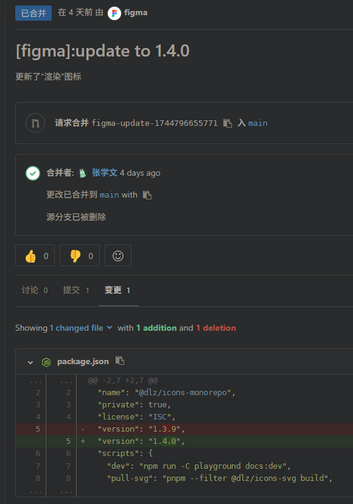

# 龙鱼图标库

统一拉取处理并发布图标

## 版本更新流程

### UI 通过 Figma 插件推送版本发布请求



本质就是一个版本更新提交，所以这一步由开发处理也可以。

### 合并版本更新请求

### 本地仓库拉取最新代码

### 构建

执行命令`npm run build`

该命令会进行图标拉取、组件生成、NPM 发布、文档网站打包。
完成此步骤，npm 包就已经发布完成了，后续是文档网站的处理

> 因为会从 Figma 拉取大量图片，如果网络环境不好，可能过程会非常缓慢，建议开启 VPN。

如果图标资源来自设计师导出的 SVG zip，可以在构建时指定本地资源包：

```bash
LY_ICONS_ZIP=/Users/liuke/Downloads/download.zip pnpm build
```

也可以先单独导入 SVG，再执行组件构建：

```bash
LY_ICONS_ZIP=/Users/liuke/Downloads/download.zip pnpm pull-svg:local
pnpm build-comp
```

本地目录资源可以使用 `LY_ICONS_SOURCE_DIR=/path/to/icons` 指定。

### 将变更内容提交

提交格式为 `chore: release [版本号]`
例如：`chore: release v1.4.0`

### 部署文档网站

[ly-icons-common 流水线地址](http://159.75.92.112:32458/view/D%E9%BE%99%E9%B1%BC-COMMON/job/ly-icons-common/)

### 查阅文档网站确认部署成功

[图标文档网站](https://icon.longyu.com/)
